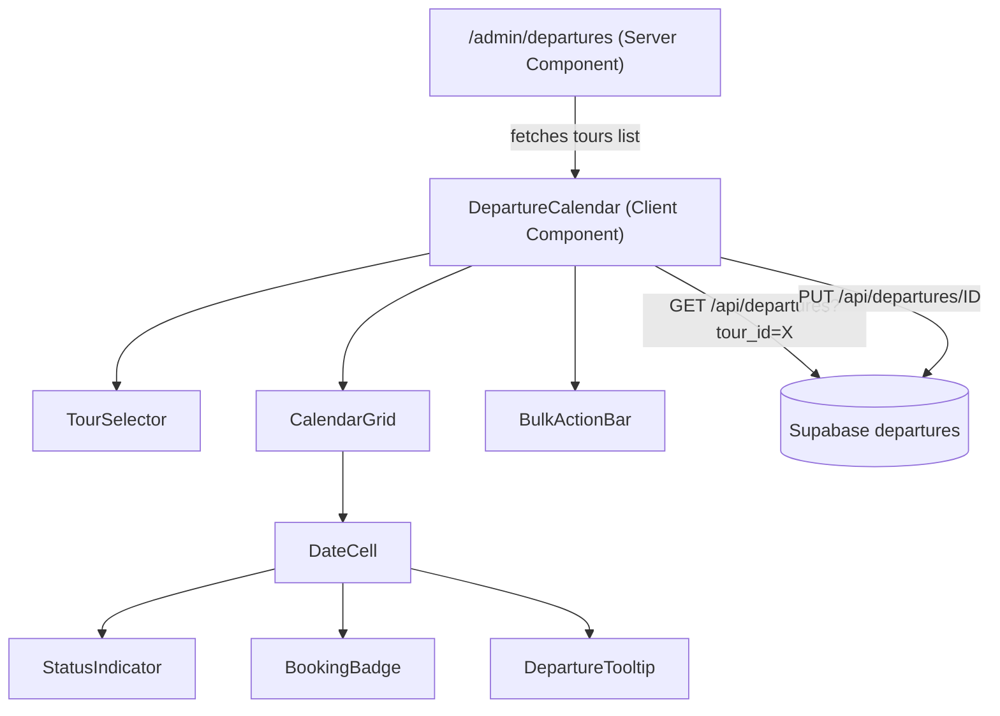

# Design Document: Admin Departure Calendar

## Overview

The Admin Departure Calendar replaces the current table-only departures view (`DeparturesManager`) at `/admin/departures` with an interactive month-grid calendar. The calendar lets administrators visualize departure status per tour, toggle individual dates hidden/active with a single click, and bulk-toggle date ranges via Shift+click selection. It reuses the existing `/api/departures` and `/api/departures/[id]` API endpoints and the `Departure` type, requiring no backend changes.

### Key Design Decisions

1. **No external calendar library** — a custom `<CalendarGrid>` component built with CSS Grid (7 columns) keeps the bundle small and gives full control over cell rendering.
2. **Client component with optimistic updates** — the calendar is a `"use client"` component that fetches departures on mount and on tour/month change, applies optimistic UI on toggle, and reverts on failure.
3. **Existing API reuse** — all reads go through `GET /api/departures?tour_id={id}`, all writes through `PUT /api/departures/{id}`. No new endpoints needed.
4. **Replace, don't remove** — the page at `src/app/admin/departures/page.tsx` will render the new `DepartureCalendar` component instead of `DeparturesManager`.

## Architecture



### Data Flow

1. The server component at `/admin/departures` fetches the tours list via `supabaseAdmin` and passes it as a prop.
2. `DepartureCalendar` (client) receives `tours`, renders `TourSelector`. On tour selection, it fetches departures for that tour from the API.
3. Departures are indexed into a `Map<string, Departure>` keyed by date string (`YYYY-MM-DD`) for O(1) cell lookup.
4. `CalendarGrid` renders 42 cells (6 weeks × 7 days) for the displayed month. Each `DateCell` looks up its departure from the map.
5. Toggle actions (single click or bulk) call `PUT /api/departures/{id}` with `{ hidden: !current }`. The UI updates optimistically; on failure it reverts and shows a toast.

## Components and Interfaces

### Component Tree

```
src/app/admin/departures/page.tsx          — Server component (fetches tours)
src/components/admin/DepartureCalendar.tsx  — Main client component (state, fetching, actions)
src/components/admin/calendar/
  TourSelector.tsx                          — Dropdown for tour filtering
  CalendarGrid.tsx                          — Month grid layout (7-col CSS grid)
  DateCell.tsx                              — Single day cell with status + interactions
  StatusIndicator.tsx                       — Colored dot/icon for departure state
  BookingBadge.tsx                          — Small badge showing booked-spot count
  DepartureTooltip.tsx                      — Hover tooltip with departure details
  BulkActionBar.tsx                         — Contextual bar for range actions
  CalendarLegend.tsx                        — Legend mapping colors to statuses
```

### Key Interfaces

```typescript
// Props for the main calendar component
interface DepartureCalendarProps {
  tours: Pick<Tour, "id" | "title">[];
}

// Internal state shape
interface CalendarState {
  selectedTourId: string | null;
  currentMonth: Date;               // first day of displayed month
  departures: Departure[];          // raw array from API
  departureMap: Map<string, Departure>; // keyed by YYYY-MM-DD
  loading: boolean;
  error: string | null;
}

// Range selection state
interface RangeSelection {
  anchorDate: string | null;        // YYYY-MM-DD of first click
  endDate: string | null;           // YYYY-MM-DD of Shift+click
  selectedDates: string[];          // all dates in range (inclusive)
}

// DateCell props
interface DateCellProps {
  date: Date;
  departure: Departure | null;
  isCurrentMonth: boolean;
  isInRange: boolean;
  isRangeAnchor: boolean;
  isToggling: boolean;
  onToggle: (departure: Departure) => void;
  onRangeSelect: (dateStr: string, isShift: boolean) => void;
}

// Tooltip props
interface DepartureTooltipProps {
  departure: Departure;
}

// BulkActionBar props
interface BulkActionBarProps {
  selectedCount: number;
  onHideAll: () => void;
  onActivateAll: () => void;
  onClear: () => void;
}
```

### Interaction Logic

**Single toggle:**
1. User clicks a `DateCell` that has a departure (no Shift held).
2. `DepartureCalendar` calls `handleToggle(departure)`.
3. Optimistically flip `hidden` in local state → re-render cell.
4. `PUT /api/departures/{id}` with `{ hidden: !departure.hidden }`.
5. On success: keep new state. On failure: revert and show error.

**Range selection:**
1. User clicks a `DateCell` → sets `anchorDate`.
2. User Shift+clicks another `DateCell` → sets `endDate`, computes all dates between (inclusive), highlights them.
3. `BulkActionBar` appears with count and "Hide All" / "Activate All" buttons.
4. On action: fire `PUT` requests in parallel via `Promise.allSettled` for each departure in range.
5. On partial failure: revert failed ones, show error with count.
6. Escape or click outside clears selection.

## Data Models

### Existing Models (no changes)

The feature uses the existing `Departure` interface from `src/types/index.ts`:

```typescript
interface Departure {
  id: string;
  tour_id: string;
  date: string;       // YYYY-MM-DD
  time: string;       // HH:MM
  capacity: number;
  spots_left: number;
  active: boolean;
  sold_out: boolean;
  hidden: boolean;
  created_at: string;
  updated_at: string;
}
```

### Derived Data

The calendar derives a `Map<string, Departure>` from the departures array for O(1) lookup per cell:

```typescript
function buildDepartureMap(departures: Departure[]): Map<string, Departure> {
  const map = new Map<string, Departure>();
  for (const dep of departures) {
    map.set(dep.date, dep);
  }
  return map;
}
```

Note: if multiple departures exist for the same tour on the same date, only the first is shown. This matches the current business model where each tour has at most one departure per date.

### Calendar Date Utilities

```typescript
// Get all dates to render for a month (6 weeks × 7 days = 42 cells)
function getCalendarDays(month: Date): Date[] { ... }

// Format Date to YYYY-MM-DD string for map lookup
function formatDateKey(date: Date): string { ... }

// Get all dates between two date strings, inclusive
function getDateRange(start: string, end: string): string[] { ... }
```


## Correctness Properties

*A property is a characteristic or behavior that should hold true across all valid executions of a system — essentially, a formal statement about what the system should do. Properties serve as the bridge between human-readable specifications and machine-verifiable correctness guarantees.*

### Property 1: Tour list alphabetical ordering

*For any* list of tours passed to the TourSelector, the rendered options should appear in alphabetical order by title.

**Validates: Requirements 1.1**

### Property 2: Month navigation round trip

*For any* starting month, navigating forward N months and then backward N months should return to the original month and year.

**Validates: Requirements 1.3, 1.4**

### Property 3: Month heading matches displayed month

*For any* `currentMonth` Date value, the rendered heading text should contain the correct full month name and four-digit year for that date.

**Validates: Requirements 1.5**

### Property 4: Departure filtering by tour and month

*For any* set of departures and a selected (tourId, month) pair, the calendar should display exactly those departures whose `tour_id` matches and whose `date` falls within the displayed month.

**Validates: Requirements 1.2**

### Property 5: Status indicator mapping

*For any* departure, the status indicator is determined by a pure function of `(active, sold_out, hidden)`: green when active and not sold out and not hidden, red when sold out, gray/muted when hidden, and absent when no departure exists for the date.

**Validates: Requirements 2.1, 2.2, 2.3, 2.5**

### Property 6: Booking count computation

*For any* departure where `spots_left < capacity`, the booking badge should display `capacity - spots_left`. *For any* departure where `spots_left === capacity`, no booking badge should be shown.

**Validates: Requirements 2.4**

### Property 7: Toggle flips hidden field

*For any* departure, invoking the toggle action should produce a new departure state where `hidden` is the logical negation of the original `hidden` value, with all other fields unchanged.

**Validates: Requirements 3.1, 3.2**

### Property 8: Optimistic revert on failure

*For any* departure and a toggle action that results in an API failure, the departure state after the failed request should be identical to the departure state before the toggle was initiated.

**Validates: Requirements 3.4, 7.4**

### Property 9: Loading state prevents re-toggle

*For any* departure that is currently being toggled (request in flight), attempting another toggle on the same departure should be a no-op — the departure state should remain unchanged.

**Validates: Requirements 3.5**

### Property 10: Date range computation

*For any* two date strings A and B (both YYYY-MM-DD), `getDateRange(A, B)` should return an array containing every date between min(A, B) and max(A, B) inclusive, in chronological order, with length equal to `|daysBetween(A, B)| + 1`.

**Validates: Requirements 4.1**

### Property 11: Bulk toggle sets target value

*For any* set of departures within a range selection and a target hidden value (true for "Hide All", false for "Activate All"), after the bulk action completes successfully, every departure in the set should have its `hidden` field equal to the target value.

**Validates: Requirements 4.3, 4.4**

### Property 12: Partial bulk failure revert

*For any* set of departures in a bulk toggle where a subset of API calls fail, the departures whose calls failed should revert to their pre-toggle `hidden` value, while the departures whose calls succeeded should retain the new target value.

**Validates: Requirements 4.6**

### Property 13: Calendar grid structure

*For any* month, `getCalendarDays(month)` should return exactly 42 dates (6 rows × 7 columns), the first date should be a Sunday, the last date should be a Saturday, and all dates of the target month should be present in the result.

**Validates: Requirements 5.4**

### Property 14: Tooltip contains all departure details

*For any* departure, the tooltip data should include the departure's `time`, `capacity`, `spots_left`, and a status string derived from `(active, sold_out, hidden)`.

**Validates: Requirements 6.1, 6.3**

## Error Handling

### Toggle Failures (Single)

- On `PUT` failure: revert the optimistic `hidden` flip in local state, show a toast notification with the error message.
- The cell returns to its pre-toggle visual state immediately.

### Toggle Failures (Bulk)

- Use `Promise.allSettled` for parallel requests.
- On partial failure: revert only the departures whose requests failed, keep successful ones.
- Show a toast: "X of Y updates failed. Please retry."

### Fetch Failures

- On initial load or tour change: if `GET /api/departures?tour_id=X` fails, display an inline error message within the calendar card with a "Retry" button.
- The retry button re-triggers the fetch.

### Loading States

- While fetching departures: render a skeleton grid (42 placeholder cells with pulse animation).
- While toggling a single cell: show a small spinner in the cell and disable click.
- While bulk toggling: disable all cells in the range and show a loading state on the BulkActionBar buttons.

### Edge Cases

- Tour with zero departures in a month: show empty calendar grid with no indicators.
- Multiple rapid toggles on different cells: each toggle is independent; they can run concurrently.
- Shift+click with no prior anchor: treat as a regular click (set anchor, no range).
- Range spanning dates with no departures: only departures that exist in the range are toggled; empty dates are ignored.

## Testing Strategy

### Unit Tests

Unit tests cover specific examples, edge cases, and integration points:

- `getCalendarDays`: specific months (e.g., February 2024 leap year, January 2025) produce correct 42-day arrays.
- `getDateRange`: edge case of same start and end date returns single-element array.
- `buildDepartureMap`: handles empty array, handles duplicate dates (last wins or first wins — verify behavior).
- `getStatusIndicator`: specific departure objects map to expected status strings.
- Component rendering: `TourSelector` renders all tours, `CalendarLegend` renders all status entries, `BulkActionBar` shows correct count.
- Error state: fetch failure renders error message and retry button.
- Loading state: skeleton renders 42 placeholder cells.

### Property-Based Tests

Property-based tests verify universal properties across randomized inputs. Use `fast-check` as the PBT library.

Each property test must:
- Run a minimum of 100 iterations
- Reference its design property with a tag comment: `// Feature: admin-departure-calendar, Property N: <title>`
- Be implemented as a single `fc.assert(fc.property(...))` call

Properties to implement:

1. **Feature: admin-departure-calendar, Property 1: Tour list alphabetical ordering** — generate random tour arrays, verify sorted output.
2. **Feature: admin-departure-calendar, Property 2: Month navigation round trip** — generate random months and step counts, verify round trip.
3. **Feature: admin-departure-calendar, Property 3: Month heading matches displayed month** — generate random Date values, verify heading text.
4. **Feature: admin-departure-calendar, Property 4: Departure filtering by tour and month** — generate random departures across tours/months, verify filter correctness.
5. **Feature: admin-departure-calendar, Property 5: Status indicator mapping** — generate random (active, sold_out, hidden) tuples, verify indicator.
6. **Feature: admin-departure-calendar, Property 6: Booking count computation** — generate random capacity/spots_left pairs, verify badge value.
7. **Feature: admin-departure-calendar, Property 7: Toggle flips hidden field** — generate random departures, verify hidden negation.
8. **Feature: admin-departure-calendar, Property 8: Optimistic revert on failure** — generate random departures, simulate failure, verify state restored.
9. **Feature: admin-departure-calendar, Property 9: Loading state prevents re-toggle** — generate random departures in toggling state, verify no-op.
10. **Feature: admin-departure-calendar, Property 10: Date range computation** — generate random date pairs, verify range length and contents.
11. **Feature: admin-departure-calendar, Property 11: Bulk toggle sets target value** — generate random departure sets and target boolean, verify all match target.
12. **Feature: admin-departure-calendar, Property 12: Partial bulk failure revert** — generate random departure sets with random failure indices, verify correct revert/keep.
13. **Feature: admin-departure-calendar, Property 13: Calendar grid structure** — generate random months, verify 42 days, Sunday start, Saturday end, all month days present.
14. **Feature: admin-departure-calendar, Property 14: Tooltip contains all departure details** — generate random departures, verify tooltip data completeness.

### Test File Organization

```
src/components/admin/calendar/__tests__/
  calendarUtils.test.ts          — unit + property tests for pure utility functions
  statusIndicator.test.ts        — unit + property tests for status mapping
  DepartureCalendar.test.tsx     — component integration tests
  bulkToggle.test.ts             — unit + property tests for bulk action logic
```
