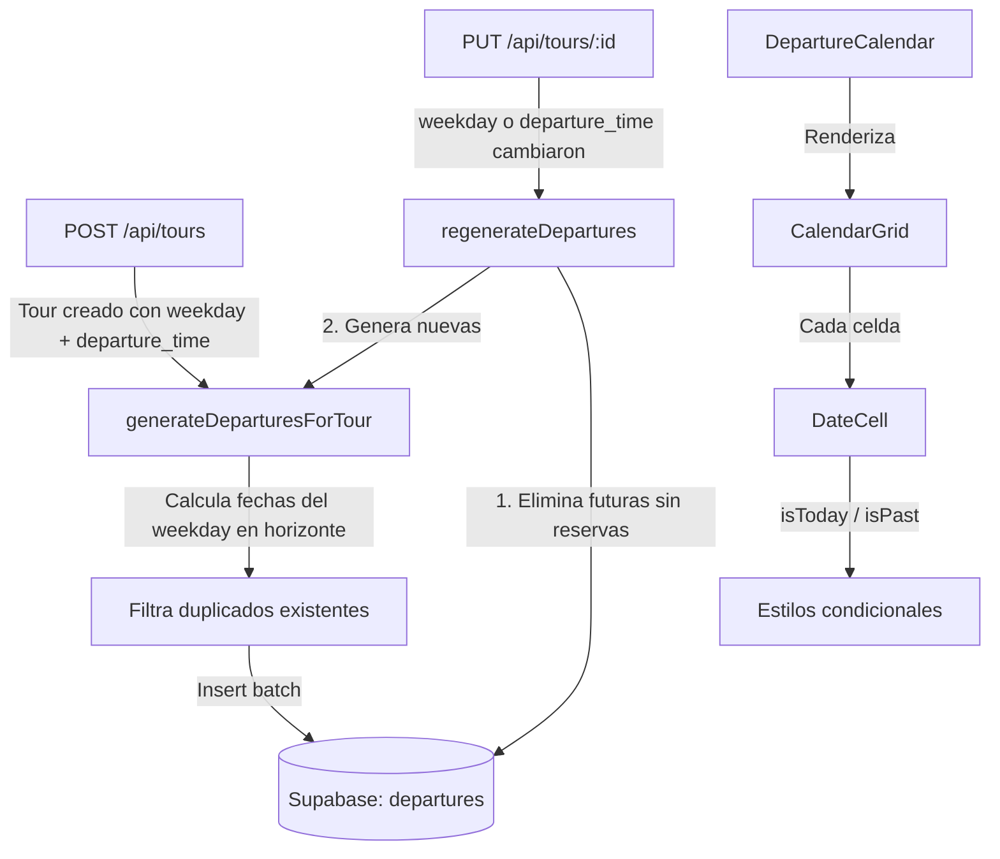

# Diseño: Auto-generación de Departures

## Resumen

Este diseño describe la implementación de la generación automática de departures cuando se crea o actualiza un tour con `weekday` y `departure_time` definidos. Se introduce una función pura de cálculo de fechas (`generateDeparturesForTour`), una función de regeneración que protege departures con reservas (`regenerateDepartures`), integración en los endpoints POST y PUT de tours, y mejoras visuales en el calendario (resaltado de hoy, atenuación de fechas pasadas, deshabilitación de toggle en pasado).

## Arquitectura



La lógica de generación vive en un módulo utilitario del servidor (`src/lib/departures/generate.ts`) que es importado por ambos endpoints de tours. No se usa cron ni worker; la generación es síncrona dentro del request de creación/actualización del tour.

## Componentes e Interfaces

### 1. Módulo `src/lib/departures/generate.ts`

Este módulo exporta dos funciones principales y una constante configurable:

```typescript
/** Horizonte por defecto en meses */
export const DEFAULT_HORIZON_MONTHS = 3;

/**
 * Calcula las fechas futuras que coinciden con el weekday dado,
 * desde `startDate` (por defecto hoy) hasta `startDate + horizonMonths`.
 * Función PURA: no accede a DB.
 */
export function computeDepartureDates(
  weekday: number,          // 0=Dom...6=Sáb
  startDate: Date,          // fecha de inicio (típicamente mañana)
  horizonMonths: number     // meses hacia adelante
): string[];                // array de "YYYY-MM-DD"

/**
 * Genera departures para un tour. Inserta en DB solo las fechas
 * que no tengan ya una departure existente para ese tour.
 * Retorna el conteo de departures creadas.
 */
export async function generateDeparturesForTour(
  tourId: string,
  weekday: number,
  departureTime: string,
  capacityDefault: number,
  horizonMonths?: number     // default = DEFAULT_HORIZON_MONTHS
): Promise<{ created: number }>;

/**
 * Regenera departures: elimina futuras sin reservas, luego genera nuevas.
 * Si newWeekday o newDepartureTime son null, solo elimina sin generar.
 * Retorna conteos de eliminadas y creadas.
 */
export async function regenerateDepartures(
  tourId: string,
  newWeekday: number | null,
  newDepartureTime: string | null,
  capacityDefault: number,
  horizonMonths?: number
): Promise<{ deleted: number; created: number }>;
```

### 2. Integración en `POST /api/tours` (route.ts)

Después de insertar el tour exitosamente, si `weekday` y `departure_time` son no nulos:
- Llamar a `generateDeparturesForTour(tour.id, weekday, departure_time, capacity_default)`.
- Incluir `departures_created` en la respuesta JSON.
- Si falla la generación, retornar el tour con un campo `warning` en lugar de un error 500.

### 3. Integración en `PUT /api/tours/:id` (route.ts)

Después de actualizar el tour exitosamente:
- Obtener el tour anterior (antes del update) para comparar `weekday` y `departure_time`.
- Si `weekday` o `departure_time` cambiaron:
  - Llamar a `regenerateDepartures(id, newWeekday, newDepartureTime, capacity_default)`.
  - Incluir `departures_deleted` y `departures_created` en la respuesta.
- Si no cambiaron, no hacer nada con departures.

### 4. Cambios en `DateCell.tsx`

Agregar props `isToday` y `isPast` al componente:

```typescript
interface DateCellProps {
  // ... props existentes
  isToday: boolean;
  isPast: boolean;
}
```

- `isToday`: borde verde sólido (`border-[#4CBB17] border-2`) y fondo sutil.
- `isPast`: opacidad reducida (`opacity-50`), cursor default, toggle deshabilitado.

### 5. Cambios en `CalendarGrid.tsx`

Calcular `today` como `formatDateKey(new Date())` y pasar `isToday` e `isPast` a cada `DateCell`:

```typescript
const todayStr = formatDateKey(new Date());
// En el map:
const dateKey = formatDateKey(date);
const isPast = dateKey < todayStr;
const isToday = dateKey === todayStr;
```

## Modelos de Datos

No se requieren cambios en el esquema de la base de datos. Se utilizan las tablas existentes:

### Tabla `tours` (campos relevantes)
| Campo | Tipo | Descripción |
|-------|------|-------------|
| id | uuid | PK |
| weekday | integer \| null | 0=Dom...6=Sáb, null = sin día fijo |
| departure_time | text \| null | "HH:MM", null = sin hora fija |
| capacity_default | integer | Capacidad por defecto para departures |

### Tabla `departures` (campos relevantes)
| Campo | Tipo | Descripción |
|-------|------|-------------|
| id | uuid | PK |
| tour_id | uuid | FK → tours.id |
| date | date | YYYY-MM-DD |
| time | text | HH:MM |
| capacity | integer | Capacidad total |
| spots_left | integer | Lugares disponibles |
| active | boolean | Si está activa |
| sold_out | boolean | Si está agotada |
| hidden | boolean | Si está oculta |

### Lógica de detección de reservas

Una departure tiene reservas cuando `spots_left < capacity`. Esta es la condición que protege a una departure de ser eliminada durante la regeneración.

### Lógica de `computeDepartureDates` (función pura)

```
Entrada: weekday (0-6), startDate, horizonMonths
1. endDate = startDate + horizonMonths meses
2. cursor = primer día >= startDate cuyo getDay() === weekday
3. Mientras cursor < endDate:
   a. Agregar formatDateKey(cursor) al resultado
   b. cursor += 7 días
4. Retornar array de strings "YYYY-MM-DD"
```

### Lógica de `generateDeparturesForTour`

```
1. dates = computeDepartureDates(weekday, mañana, horizonMonths)
2. Consultar departures existentes del tour con fecha en `dates`
3. existingDates = Set de fechas ya existentes
4. newDates = dates.filter(d => !existingDates.has(d))
5. Insert batch de departures con: tour_id, date, time=departureTime,
   capacity=capacityDefault, spots_left=capacityDefault,
   active=true, sold_out=false, hidden=false
6. Retornar { created: newDates.length }
```

### Lógica de `regenerateDepartures`

```
1. tomorrow = fecha de mañana (YYYY-MM-DD)
2. Consultar departures del tour con fecha >= tomorrow
3. deletable = departures donde spots_left === capacity (sin reservas)
4. Eliminar deletable → deleted = deletable.length
5. Si newWeekday !== null && newDepartureTime !== null:
   a. { created } = generateDeparturesForTour(tourId, newWeekday, newDepartureTime, capacityDefault, horizonMonths)
6. Sino: created = 0
7. Retornar { deleted, created }
```


## Propiedades de Correctitud

*Una propiedad es una característica o comportamiento que debe mantenerse verdadero en todas las ejecuciones válidas de un sistema — esencialmente, una declaración formal sobre lo que el sistema debe hacer. Las propiedades sirven como puente entre especificaciones legibles por humanos y garantías de correctitud verificables por máquina.*

### Propiedad 1: Todas las fechas generadas coinciden con el weekday y caen dentro del horizonte

*Para cualquier* weekday válido (0-6), fecha de inicio y horizonte en meses, todas las fechas retornadas por `computeDepartureDates` deben cumplir que `new Date(fecha).getDay() === weekday`, y cada fecha debe ser >= startDate y < startDate + horizonMonths meses.

**Valida: Requisitos 1.1, 2.2, 3.3**

### Propiedad 2: Todas las departures generadas tienen valores por defecto correctos

*Para cualquier* tour con weekday, departure_time y capacity_default válidos, cada departure generada por `generateDeparturesForTour` debe tener `capacity === capacityDefault`, `spots_left === capacityDefault`, `time === departureTime`, `active === true`, `sold_out === false` y `hidden === false`.

**Valida: Requisitos 1.2, 1.3, 1.4, 1.5**

### Propiedad 3: Weekday o departure_time nulos no producen departures nuevas

*Para cualquier* tour donde `weekday` sea null o `departure_time` sea null, la función de generación/regeneración no debe crear ninguna departure nueva (created === 0).

**Valida: Requisitos 1.6, 2.5**

### Propiedad 4: La regeneración preserva departures pasadas y con reservas, elimina solo futuras sin reservas

*Para cualquier* conjunto de departures existentes de un tour, después de ejecutar `regenerateDepartures`: (a) toda departure con fecha <= hoy debe permanecer intacta, (b) toda departure con `spots_left < capacity` debe permanecer intacta independientemente de su fecha, y (c) toda departure futura con `spots_left === capacity` debe ser eliminada.

**Valida: Requisitos 2.1, 2.3, 2.4, 4.2, 4.3**

### Propiedad 5: No se crean departures duplicadas por fecha

*Para cualquier* tour y conjunto de fechas existentes, después de ejecutar `generateDeparturesForTour`, no debe existir más de una departure por fecha para ese tour. Si ya existe una departure en una fecha, no se crea otra.

**Valida: Requisito 4.4**

### Propiedad 6: Fechas pasadas deshabilitan la interacción de toggle

*Para cualquier* fecha anterior a la fecha actual, el componente `DateCell` con `isPast=true` no debe ejecutar la función `onToggle` al hacer click.

**Valida: Requisito 5.3**

## Manejo de Errores

| Escenario | Comportamiento |
|-----------|---------------|
| Fallo en generación de departures al crear tour | El tour se crea exitosamente. La respuesta incluye el tour + campo `warning` con el mensaje de error. No se hace rollback del tour. |
| Fallo en regeneración al actualizar tour | El tour se actualiza exitosamente. La respuesta incluye el tour + campo `warning`. Las departures existentes no se modifican si el error ocurre antes de la eliminación. |
| Fallo parcial en insert batch de departures | Se retorna el tour con `departures_created` indicando cuántas se crearon exitosamente y `warning` si hubo error. |
| `weekday` fuera de rango (< 0 o > 6) | `computeDepartureDates` retorna array vacío. No se generan departures. |
| `horizonMonths` <= 0 | `computeDepartureDates` retorna array vacío. |
| Tour no encontrado en PUT | Se retorna 404 antes de intentar regeneración. |

## Estrategia de Testing

### Testing unitario

- Verificar que `computeDepartureDates` retorna fechas correctas para casos específicos (ej: weekday=1 desde un lunes, weekday=0 desde un miércoles).
- Verificar que `DEFAULT_HORIZON_MONTHS === 3` (Requisito 3.1).
- Verificar que la respuesta de la API incluye `departures_created` al crear un tour (Requisito 6.1).
- Verificar que la respuesta de la API incluye `departures_deleted` y `departures_created` al actualizar (Requisito 6.2).
- Verificar que un fallo en generación retorna `warning` en la respuesta (Requisito 6.3).
- Verificar que `DateCell` con `isToday=true` renderiza con clase de borde verde (Requisito 5.1).
- Verificar que `DateCell` con `isPast=true` renderiza con opacidad reducida (Requisito 5.2).
- Verificar edge cases: horizonte de 0 meses, weekday en el mismo día que startDate.

### Testing basado en propiedades

Se usará `fast-check` (ya instalado en el proyecto) con mínimo 100 iteraciones por propiedad.

Cada test de propiedad debe estar etiquetado con un comentario referenciando la propiedad del diseño:

- **Feature: auto-departure-generation, Property 1: Todas las fechas generadas coinciden con el weekday y caen dentro del horizonte**
  - Generar weekday aleatorio (0-6), startDate aleatoria, horizonMonths aleatorio (1-12). Verificar que todas las fechas cumplen getDay() === weekday y están en rango.

- **Feature: auto-departure-generation, Property 2: Todas las departures generadas tienen valores por defecto correctos**
  - Generar capacity_default aleatorio (1-100), departure_time aleatorio ("HH:MM"). Verificar que cada departure generada tiene los campos correctos.

- **Feature: auto-departure-generation, Property 3: Weekday o departure_time nulos no producen departures nuevas**
  - Generar combinaciones donde al menos uno sea null. Verificar created === 0.

- **Feature: auto-departure-generation, Property 4: La regeneración preserva departures pasadas y con reservas**
  - Generar conjunto aleatorio de departures (mezcla de pasadas/futuras, con/sin reservas). Ejecutar regeneración. Verificar que las protegidas sobreviven y las eliminables desaparecen.

- **Feature: auto-departure-generation, Property 5: No se crean departures duplicadas por fecha**
  - Generar fechas existentes aleatorias y ejecutar generación. Verificar unicidad de fechas.

- **Feature: auto-departure-generation, Property 6: Fechas pasadas deshabilitan toggle**
  - Generar fechas pasadas aleatorias, renderizar DateCell con isPast=true, simular click. Verificar que onToggle no se invoca.

Cada propiedad del diseño debe ser implementada por un ÚNICO test de propiedad. Los unit tests complementan cubriendo ejemplos específicos, edge cases y la integración con la API.
