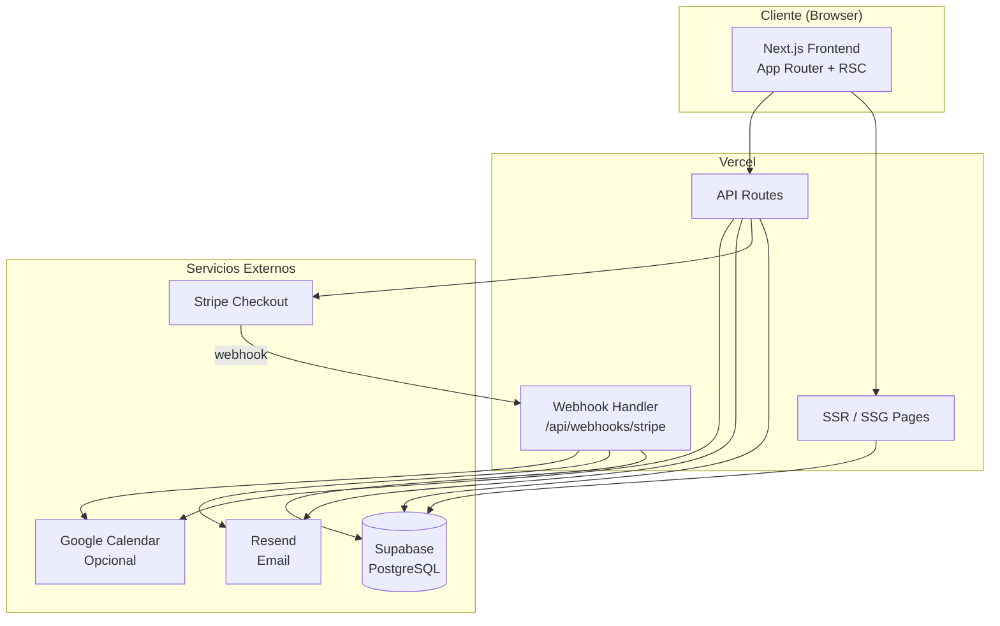
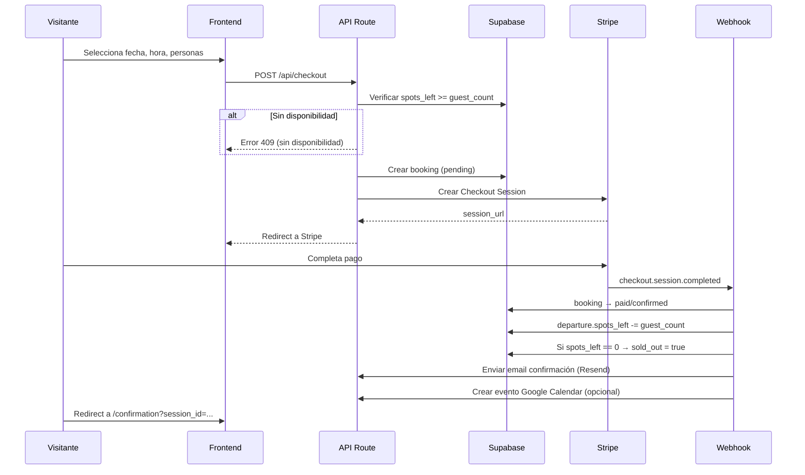
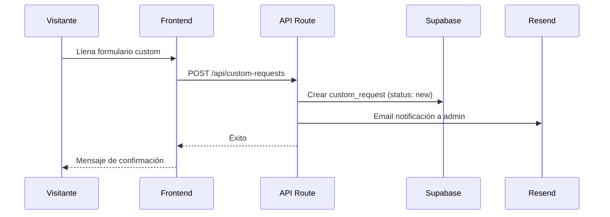
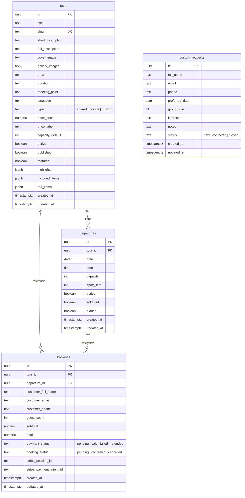

# Documento de Diseño — EMO Tours CDMX

## Visión General

EMO Tours CDMX es una plataforma de reservas de tours en la Ciudad de México construida con Next.js (App Router), Supabase, Stripe Checkout, Resend y Tailwind CSS. El sistema maneja dos flujos principales: reserva directa de tours fijos (shared/private) con pago vía Stripe, y solicitudes de tours personalizados (custom) como leads. El frontend replica fielmente las 6 pantallas aprobadas en Stitch, usando los tokens de diseño definidos (Kelly Green #4CBB17, Space Grotesk, Inter, glassmorphism).

La arquitectura sigue un modelo server-first con SSR/SSG para páginas públicas, API routes para lógica de negocio, y webhooks de Stripe como fuente de verdad para confirmación de pagos. La capacidad se gestiona exclusivamente a nivel de salida (departure), no de tour.

## Arquitectura

### Diagrama de Arquitectura General



### Flujo de Reserva (Tour Fijo)



### Flujo de Tour Personalizado



### Estructura de Carpetas

```
src/
├── app/
│   ├── layout.tsx              # Root layout (Navbar + Footer)
│   ├── page.tsx                # Homepage
│   ├── tours/
│   │   ├── page.tsx            # Tours Listing
│   │   └── [slug]/
│   │       └── page.tsx        # Tour Detail
│   ├── checkout/
│   │   └── page.tsx            # Checkout page
│   ├── confirmation/
│   │   └── page.tsx            # Booking Confirmation
│   ├── custom-tours/
│   │   └── page.tsx            # Custom Tours form
│   ├── admin/
│   │   ├── layout.tsx          # Admin layout
│   │   ├── page.tsx            # Dashboard
│   │   ├── tours/
│   │   │   ├── page.tsx        # Listado tours
│   │   │   ├── new/page.tsx    # Crear tour
│   │   │   └── [id]/page.tsx   # Editar tour
│   │   ├── departures/
│   │   │   └── page.tsx        # Gestión salidas
│   │   ├── bookings/
│   │   │   └── page.tsx        # Listado reservas
│   │   └── custom-requests/
│   │       └── page.tsx        # Listado solicitudes
│   └── api/
│       ├── checkout/route.ts
│       ├── custom-requests/route.ts
│       ├── tours/route.ts
│       ├── departures/route.ts
│       ├── bookings/route.ts
│       └── webhooks/
│           └── stripe/route.ts
├── components/
│   ├── layout/
│   │   ├── Navbar.tsx
│   │   └── Footer.tsx
│   ├── tours/
│   │   ├── TourCard.tsx
│   │   ├── TourGallery.tsx
│   │   ├── MetadataChips.tsx
│   │   ├── PriceBlock.tsx
│   │   ├── FaqAccordion.tsx
│   │   └── TestimonialCard.tsx
│   ├── booking/
│   │   ├── BookingModule.tsx
│   │   ├── AvailabilitySelector.tsx
│   │   └── GuestCounter.tsx
│   ├── checkout/
│   │   ├── CheckoutForm.tsx
│   │   └── OrderSummary.tsx
│   ├── confirmation/
│   │   └── ConfirmationSummary.tsx
│   └── ui/
│       ├── Button.tsx
│       ├── FormField.tsx
│       └── Badge.tsx
├── lib/
│   ├── supabase/
│   │   ├── client.ts           # Browser client
│   │   └── server.ts           # Server client
│   ├── stripe.ts               # Stripe config
│   ├── resend.ts               # Resend config
│   ├── google-calendar.ts      # Google Calendar (opcional)
│   ├── capacity.ts             # Lógica de capacidad
│   └── validators.ts           # Validación de datos
├── types/
│   └── index.ts                # Tipos TypeScript
└── seed/
    └── seed.ts                 # Script de datos semilla
```


## Componentes e Interfaces

### Páginas Públicas (Server Components)

| Página | Ruta | Rendering | Datos |
|--------|------|-----------|-------|
| Homepage | `/` | SSG con revalidación | Tours featured, published, active |
| Tours Listing | `/tours` | SSG con revalidación | Todos los tours published + active |
| Tour Detail | `/tours/[slug]` | SSG (generateStaticParams) | Tour por slug + salidas activas |
| Checkout | `/checkout` | SSR (necesita query params) | Tour + departure + datos de sesión |
| Confirmation | `/confirmation` | SSR (necesita session_id) | Booking por stripe_session_id |
| Custom Tours | `/custom-tours` | SSG | Contenido estático + formulario |

### API Routes

| Endpoint | Método | Descripción | Autenticación |
|----------|--------|-------------|---------------|
| `/api/checkout` | POST | Valida disponibilidad, crea booking pending, crea Stripe Session | Pública |
| `/api/webhooks/stripe` | POST | Recibe eventos de Stripe, confirma booking, reduce spots | Stripe signature |
| `/api/custom-requests` | POST | Crea solicitud custom, envía email a admin | Pública |
| `/api/tours` | GET/POST/PUT | CRUD de tours | Admin |
| `/api/departures` | GET/POST/PUT | CRUD de salidas | Admin |
| `/api/bookings` | GET/PUT | Listado y actualización de reservas | Admin |

### Componentes Principales

**BookingModule** — Componente interactivo (Client Component) en Tour Detail:
- Props: `tour: Tour`, `departures: Departure[]`
- Estado interno: `selectedDate`, `selectedTime`, `guestCount`
- Calcula `totalPrice = tour.base_price × guestCount`
- Valida `guestCount <= departure.spots_left`
- Deshabilita CTA si la salida está sold_out o guest_count excede spots_left
- Al confirmar, navega a `/checkout` con query params: `tourId`, `departureId`, `guestCount`

**AvailabilitySelector** — Sub-componente del BookingModule:
- Agrupa salidas por fecha
- Muestra horarios disponibles para la fecha seleccionada
- Muestra spots_left para el horario seleccionado
- Excluye salidas hidden, inactive o sold_out

**CheckoutForm** — Formulario de datos del cliente:
- Campos: `customer_full_name`, `customer_email`, `customer_phone`
- Validación client-side (campos requeridos, formato email, formato teléfono)
- Al submit: POST a `/api/checkout` con datos del cliente + selección de tour

**OrderSummary** — Resumen de la orden en checkout:
- Muestra: nombre del tour, fecha, hora, guest_count, precio unitario, total
- Datos recibidos via query params y fetch del tour/departure

**ConfirmationSummary** — Resumen post-pago:
- Recibe `session_id` de Stripe via query param
- Fetch del booking por `stripe_session_id`
- Muestra: estado de éxito, nombre del tour, fecha, hora, guest_count, total, punto de encuentro
- Si no hay booking válido confirmado, redirect a homepage

### Componentes UI Reutilizables

| Componente | Uso | Props principales |
|------------|-----|-------------------|
| Navbar | Layout global | — |
| Footer | Layout global | — |
| TourCard | Homepage, Tours Listing | `tour: Tour` |
| MetadataChips | Tour Detail | `area, duration, language, meetingPoint` |
| PriceBlock | Tour Detail, Checkout | `basePrice, guestCount, total` |
| FaqAccordion | Tour Detail | `items: FaqItem[]` |
| TestimonialCard | Homepage | `testimonial: Testimonial` |
| Button | Global | `variant, size, disabled, loading` |
| FormField | Checkout, Custom Tours | `label, type, error, required` |
| Badge | Tours Listing, Admin | `text, variant` |

### Tokens de Diseño (de Stitch)

```typescript
const designTokens = {
  colors: {
    primary: '#4CBB17',       // Kelly Green
    primaryDark: '#3A9212',
    background: '#0A0A0A',    // Dark background
    surface: 'rgba(255,255,255,0.05)', // Glassmorphism
    text: '#FFFFFF',
    textSecondary: '#A0A0A0',
  },
  fonts: {
    heading: 'Space Grotesk',
    body: 'Inter',
  },
  effects: {
    glassmorphism: 'backdrop-blur-md bg-white/5 border border-white/10',
  },
}
```

## Modelos de Datos

### Esquema de Base de Datos (Supabase / PostgreSQL)



### Tipos TypeScript

```typescript
// types/index.ts

export type TourType = 'shared' | 'private' | 'custom';
export type PaymentStatus = 'pending' | 'paid' | 'failed' | 'refunded';
export type BookingStatus = 'pending' | 'confirmed' | 'cancelled';
export type CustomRequestStatus = 'new' | 'contacted' | 'closed';

export interface Tour {
  id: string;
  title: string;
  slug: string;
  short_description: string;
  full_description: string;
  cover_image: string;
  gallery_images: string[];
  area: string;
  duration: string;
  meeting_point: string;
  language: string;
  type: TourType;
  base_price: number;
  price_label: string;
  capacity_default: number;
  active: boolean;
  published: boolean;
  featured: boolean;
  highlights: string[];
  included_items: string[];
  faq_items: FaqItem[];
  created_at: string;
  updated_at: string;
}

export interface FaqItem {
  question: string;
  answer: string;
}

export interface Departure {
  id: string;
  tour_id: string;
  date: string;       // YYYY-MM-DD
  time: string;       // HH:MM
  capacity: number;
  spots_left: number;
  active: boolean;
  sold_out: boolean;
  hidden: boolean;
  created_at: string;
  updated_at: string;
}

export interface Booking {
  id: string;
  tour_id: string;
  departure_id: string;
  customer_full_name: string;
  customer_email: string;
  customer_phone: string;
  guest_count: number;
  subtotal: number;
  total: number;
  payment_status: PaymentStatus;
  booking_status: BookingStatus;
  stripe_session_id: string;
  stripe_payment_intent_id: string | null;
  created_at: string;
  updated_at: string;
}

export interface CustomRequest {
  id: string;
  full_name: string;
  email: string;
  phone: string;
  preferred_date: string | null;
  group_size: number;
  interests: string;
  notes: string;
  status: CustomRequestStatus;
  created_at: string;
  updated_at: string;
}
```

### Interfaces de API

**POST /api/checkout** — Request:
```typescript
interface CheckoutRequest {
  tour_id: string;
  departure_id: string;
  guest_count: number;
  customer_full_name: string;
  customer_email: string;
  customer_phone: string;
}
```

**POST /api/checkout** — Response (éxito):
```typescript
interface CheckoutResponse {
  checkout_url: string;  // URL de Stripe Checkout
}
```

**POST /api/custom-requests** — Request:
```typescript
interface CustomRequestPayload {
  full_name: string;
  email: string;
  phone: string;
  preferred_date?: string;
  group_size: number;
  interests: string;
  notes?: string;
}
```

### Lógica de Capacidad (lib/capacity.ts)

La lógica de capacidad es el corazón del sistema de reservas. Reglas:

1. `spots_left` se inicializa igual a `capacity` al crear una salida
2. Al confirmar un booking (webhook), se ejecuta atómicamente:
   - `spots_left = spots_left - guest_count`
   - Si `spots_left == 0`, entonces `sold_out = true`
3. La validación pre-checkout verifica `spots_left >= guest_count`
4. La reducción de spots_left se hace en el webhook (no en el checkout), para evitar reservar spots antes del pago
5. Se usa una transacción o update condicional para evitar race conditions:

```sql
UPDATE departures
SET spots_left = spots_left - $guest_count,
    sold_out = CASE WHEN spots_left - $guest_count = 0 THEN true ELSE sold_out END,
    updated_at = now()
WHERE id = $departure_id
  AND spots_left >= $guest_count
RETURNING spots_left;
```

Si el UPDATE no retorna filas, significa que no había suficiente capacidad (race condition detectada) y se debe manejar como error.


## Propiedades de Correctitud

*Una propiedad es una característica o comportamiento que debe mantenerse verdadero en todas las ejecuciones válidas de un sistema — esencialmente, una declaración formal sobre lo que el sistema debe hacer. Las propiedades sirven como puente entre especificaciones legibles por humanos y garantías de correctitud verificables por máquina.*

### Propiedad 1: Visibilidad pública de tours

*Para cualquier* conjunto de tours, la función de consulta pública debe retornar únicamente tours donde `published = true` AND `active = true`. Ningún tour con `published = false` o `active = false` debe aparecer en resultados públicos.

**Valida: Requerimientos 2.2, 2.3, 7.2**

### Propiedad 2: Visibilidad pública de salidas

*Para cualquier* conjunto de salidas, la función de consulta pública debe retornar únicamente salidas donde `active = true` AND `hidden = false` AND `sold_out = false`. Ninguna salida oculta, inactiva o agotada debe aparecer en la vista pública.

**Valida: Requerimientos 3.3, 3.4, 9.1, 20.5**

### Propiedad 3: Cálculo de precio total

*Para cualquier* `base_price` (≥ 0) y `guest_count` (≥ 1), el precio total calculado debe ser exactamente `base_price × guest_count`.

**Valida: Requerimientos 9.5, 10.6**

### Propiedad 4: Validación de capacidad pre-reserva

*Para cualquier* salida y `guest_count`, el sistema debe permitir continuar al checkout si y solo si `guest_count <= spots_left` y `sold_out = false`. Si `guest_count > spots_left` o `sold_out = true`, el sistema debe bloquear la operación.

**Valida: Requerimientos 9.6, 9.7, 9.8, 10.4, 10.5**

### Propiedad 5: Reducción atómica de spots_left

*Para cualquier* reserva confirmada con `guest_count = N`, los `spots_left` de la salida correspondiente deben reducirse exactamente en N. Si `spots_left` resultante es 0, `sold_out` debe marcarse como `true` automáticamente.

**Valida: Requerimientos 3.5, 10.9, 10.10, 20.2, 20.3**

### Propiedad 6: Salida agotada bloquea nuevas reservas

*Para cualquier* salida con `sold_out = true`, todo intento de crear una nueva reserva debe ser rechazado.

**Valida: Requerimientos 3.6, 20.4**

### Propiedad 7: Estado inicial de booking es pending

*Para cualquier* reserva creada durante el flujo de checkout (antes de redirigir a Stripe), `payment_status` debe ser `"pending"` y `booking_status` debe ser `"pending"`.

**Valida: Requerimiento 10.13**

### Propiedad 8: Transición de estado por webhook

*Para cualquier* evento de webhook de Stripe, si el evento indica pago exitoso (`checkout.session.completed`), la reserva correspondiente debe transicionar a `payment_status = "paid"` y `booking_status = "confirmed"`. Si el evento indica fallo, debe transicionar a `payment_status = "failed"`.

**Valida: Requerimientos 10.8, 10.11**

### Propiedad 9: Estado inicial de solicitud custom es "new"

*Para cualquier* solicitud custom creada a través del formulario, el `status` inicial debe ser `"new"`.

**Valida: Requerimientos 5.3, 12.3**

### Propiedad 10: Validación de enums

*Para cualquier* valor de `payment_status`, debe ser uno de: `pending`, `paid`, `failed`, `refunded`. *Para cualquier* valor de `booking_status`, debe ser uno de: `pending`, `confirmed`, `cancelled`. *Para cualquier* valor de `custom_request.status`, debe ser uno de: `new`, `contacted`, `closed`.

**Valida: Requerimientos 4.2, 4.3, 5.2**

### Propiedad 11: Enrutamiento por tipo de tour

*Para cualquier* tour, si `type` es `"shared"` o `"private"`, la página de detalle debe mostrar el módulo de reserva. Si `type` es `"custom"`, debe redirigir a la página de tours personalizados.

**Valida: Requerimientos 8.3, 8.4**

### Propiedad 12: Generación de URLs por slug

*Para cualquier* tour con un `slug` dado, la URL generada para ese tour debe ser `/tours/{slug}`.

**Valida: Requerimientos 6.3, 7.4, 8.5**

### Propiedad 13: Filtrado de salidas por fecha

*Para cualquier* fecha seleccionada y conjunto de salidas visibles, el módulo de reserva debe mostrar únicamente las salidas cuya `date` coincida con la fecha seleccionada.

**Valida: Requerimiento 9.2**

### Propiedad 14: Tour sin disponibilidad

*Para cualquier* tour donde todas sus salidas están inactivas, ocultas o agotadas, la vista pública debe reflejar que el tour no tiene disponibilidad.

**Valida: Requerimiento 20.6**

### Propiedad 15: Contenido del TourCard en listado

*Para cualquier* tour renderizado como TourCard, la salida debe contener: título, imagen de portada, descripción corta, área, duración y precio base.

**Valida: Requerimiento 7.3**

### Propiedad 16: Contenido completo en Tour Detail

*Para cualquier* tour renderizado en la página de detalle, la salida debe contener: título, descripción completa, galería de imágenes, área, duración, punto de encuentro, idioma, precio, highlights, items incluidos y FAQ.

**Valida: Requerimiento 8.2**

### Propiedad 17: Round-trip CRUD de tours (Admin)

*Para cualquier* tour creado con campos válidos a través del Admin, leer ese tour de vuelta debe retornar los mismos valores para todos los campos. Actualizar cualquier campo y leer de nuevo debe reflejar el cambio.

**Valida: Requerimientos 15.1, 15.2, 15.3, 15.4, 15.5, 15.6, 15.7, 15.8**

### Propiedad 18: Round-trip CRUD de salidas (Admin)

*Para cualquier* salida creada con campos válidos a través del Admin, leer esa salida de vuelta debe retornar los mismos valores. Actualizar fecha, hora, capacidad, spots_left, hidden o sold_out y leer de nuevo debe reflejar el cambio.

**Valida: Requerimientos 16.1, 16.2, 16.3, 16.4, 16.5, 16.6**

### Propiedad 19: Duplicación de salida

*Para cualquier* salida existente, duplicarla debe crear una nueva salida con el mismo `tour_id`, `date`, `time` y `capacity`, pero con un `id` diferente y `spots_left` igual a `capacity`.

**Valida: Requerimiento 16.7**

### Propiedad 20: Filtrado de reservas en Admin

*Para cualquier* filtro de `payment_status` aplicado, todas las reservas retornadas deben tener ese `payment_status`. *Para cualquier* filtro de fecha aplicado, todas las reservas retornadas deben corresponder a salidas en esa fecha.

**Valida: Requerimientos 17.2, 17.3**

### Propiedad 21: Aislamiento de errores de servicios externos

*Para cualquier* fallo en el envío de email (Resend) o creación de evento (Google Calendar), el estado de la reserva o solicitud custom no debe verse afectado. El error debe registrarse en logs.

**Valida: Requerimientos 13.4, 14.4**

### Propiedad 22: Contenido del email de confirmación

*Para cualquier* reserva confirmada, el email de confirmación generado debe contener: nombre del tour, fecha, hora, guest_count, total pagado, punto de encuentro y próximos pasos.

**Valida: Requerimientos 13.1, 13.2**

### Propiedad 23: Validación de formulario custom

*Para cualquier* envío del formulario de tour personalizado con campos requeridos vacíos, el sistema debe retornar errores de validación específicos por cada campo vacío y no crear la solicitud.

**Valida: Requerimiento 12.5**

### Propiedad 24: Guard de página de confirmación

*Para cualquier* acceso a la página de confirmación sin un `session_id` válido correspondiente a una reserva confirmada, el sistema debe redirigir a la homepage.

**Valida: Requerimiento 11.4**

### Propiedad 25: Meta tags dinámicos por tour

*Para cualquier* tour, la página de detalle debe generar meta tags que incluyan el `title` del tour como `<title>`, la `short_description` como `meta description`, y la `cover_image` como `og:image`.

**Valida: Requerimiento 21.1**

### Propiedad 26: Notificación al admin por solicitud custom

*Para cualquier* solicitud custom creada, el sistema debe enviar un email de notificación al administrador que contenga: nombre del cliente, fecha preferida, tamaño del grupo, intereses y notas.

**Valida: Requerimiento 13.3**


## Manejo de Errores

### Errores por Capa

| Capa | Error | Manejo |
|------|-------|--------|
| **Checkout API** | Salida sin disponibilidad (spots_left < guest_count) | Retornar HTTP 409 con mensaje "La disponibilidad cambió, por favor selecciona otra opción" |
| **Checkout API** | Tour o salida no encontrada | Retornar HTTP 404 |
| **Checkout API** | Datos de formulario inválidos | Retornar HTTP 400 con errores de validación por campo |
| **Checkout API** | Error al crear Stripe Session | Retornar HTTP 502, registrar error en logs |
| **Webhook Stripe** | Firma de webhook inválida | Retornar HTTP 400, no procesar el evento |
| **Webhook Stripe** | Booking no encontrado por session_id | Registrar error en logs, retornar HTTP 200 (no reintentar) |
| **Webhook Stripe** | Race condition en reducción de spots_left | El UPDATE condicional falla silenciosamente, registrar error |
| **Custom Request API** | Campos requeridos vacíos | Retornar HTTP 400 con errores de validación por campo |
| **Email (Resend)** | Fallo en envío de email | Registrar error en logs, NO afectar estado de booking/request |
| **Google Calendar** | Fallo en creación de evento | Registrar error en logs, NO afectar estado de booking |
| **Admin API** | Tour/Salida/Booking no encontrado | Retornar HTTP 404 |
| **Frontend** | Página de confirmación sin session_id válido | Redirect a homepage |
| **Frontend** | Tour con slug inexistente | Página 404 de Next.js |

### Estrategia de Race Conditions

El principal riesgo de race condition es la sobreventa: dos usuarios intentando reservar los últimos spots simultáneamente.

Mitigación:
1. La reducción de `spots_left` se hace con un UPDATE condicional atómico en PostgreSQL (ver sección de Lógica de Capacidad)
2. Si el UPDATE no retorna filas (porque otro proceso ya tomó los spots), el webhook handler registra el error y el booking queda en estado inconsistente que el admin puede resolver manualmente
3. La validación pre-checkout es optimista (puede pasar aunque luego falle en el webhook), pero el pago solo se confirma si el webhook logra reducir spots

### Idempotencia del Webhook

Stripe puede enviar el mismo evento múltiples veces. El webhook handler debe ser idempotente:
- Verificar si el booking ya está en estado `paid` antes de procesarlo
- Si ya está confirmado, retornar HTTP 200 sin hacer cambios
- Usar `stripe_session_id` como clave de idempotencia

## Estrategia de Testing

### Enfoque Dual: Unit Tests + Property-Based Tests

El proyecto usa un enfoque dual de testing:

- **Unit tests** (Vitest): Verifican ejemplos específicos, edge cases y condiciones de error
- **Property-based tests** (fast-check + Vitest): Verifican propiedades universales con inputs generados aleatoriamente

Ambos son complementarios y necesarios para cobertura completa.

### Librería de Property-Based Testing

Se usará **fast-check** (`fc`) como librería de property-based testing, integrada con Vitest como test runner.

```bash
npm install -D vitest fast-check
```

### Configuración de Property Tests

- Mínimo **100 iteraciones** por property test
- Cada test debe referenciar la propiedad del documento de diseño con un comentario:
  ```typescript
  // Feature: emo-tours-cdmx, Property 3: Cálculo de precio total
  ```
- Tag format: **Feature: emo-tours-cdmx, Property {number}: {título}**
- Cada propiedad de correctitud debe ser implementada por un **único** property-based test

### Áreas de Testing

#### Property-Based Tests (fast-check)

| Propiedad | Área | Generadores |
|-----------|------|-------------|
| P1: Visibilidad tours | Filtrado | Tours con published/active aleatorios |
| P2: Visibilidad salidas | Filtrado | Salidas con active/hidden/sold_out aleatorios |
| P3: Cálculo precio | Aritmética | base_price (float ≥ 0), guest_count (int ≥ 1) |
| P4: Validación capacidad | Validación | spots_left (int ≥ 0), guest_count (int ≥ 1), sold_out (bool) |
| P5: Reducción spots_left | Estado | capacity (int), guest_count (int ≤ capacity) |
| P6: Sold-out bloquea | Validación | Salidas con sold_out=true, guest_count aleatorio |
| P7: Estado inicial booking | Estado | Datos de checkout aleatorios |
| P8: Transición webhook | Estado | Eventos webhook (success/failure) |
| P9: Estado inicial custom | Estado | Datos de formulario custom aleatorios |
| P10: Validación enums | Validación | Strings aleatorios vs enums válidos |
| P11: Enrutamiento tipo tour | Routing | Tours con type aleatorio |
| P12: URLs por slug | Routing | Slugs aleatorios |
| P13: Filtrado por fecha | Filtrado | Fechas y salidas aleatorias |
| P14: Tour sin disponibilidad | Estado derivado | Tours con salidas en varios estados |
| P17: CRUD tours | Round-trip | Tours con campos aleatorios |
| P18: CRUD salidas | Round-trip | Salidas con campos aleatorios |
| P19: Duplicación salida | Operación | Salidas aleatorias |
| P20: Filtrado reservas | Filtrado | Reservas con payment_status/fechas aleatorios |
| P21: Aislamiento errores | Resiliencia | Bookings + errores simulados |
| P23: Validación form custom | Validación | Formularios con campos vacíos aleatorios |
| P25: Meta tags | Rendering | Tours con datos aleatorios |

#### Unit Tests (Vitest)

| Área | Tests |
|------|-------|
| Seed data | Verificar que se crean 4 tours y ≥ 2 salidas por tour fijo |
| Checkout flow | Ejemplo completo de checkout exitoso end-to-end |
| Confirmation page | Redirect cuando no hay session_id válido |
| Custom form | Formulario con todos los campos llenos → éxito |
| Email templates | Verificar que el template incluye todos los campos requeridos |
| Webhook idempotencia | Procesar mismo evento dos veces no duplica cambios |
| Admin operations | Ejemplo de cancelar booking manualmente |
| Tour detail | Ejemplo de tour tipo custom redirige a /custom-tours |

### Estructura de Tests

```
__tests__/
├── properties/
│   ├── tour-visibility.test.ts      # P1, P2
│   ├── pricing.test.ts              # P3
│   ├── capacity.test.ts             # P4, P5, P6
│   ├── booking-state.test.ts        # P7, P8
│   ├── custom-requests.test.ts      # P9, P23
│   ├── enums.test.ts                # P10
│   ├── routing.test.ts              # P11, P12
│   ├── departures-filter.test.ts    # P13, P14
│   ├── admin-crud.test.ts           # P17, P18, P19, P20
│   ├── error-isolation.test.ts      # P21
│   └── seo.test.ts                  # P25
├── unit/
│   ├── checkout.test.ts
│   ├── webhook.test.ts
│   ├── confirmation.test.ts
│   ├── custom-form.test.ts
│   ├── email.test.ts
│   ├── seed.test.ts
│   └── admin.test.ts
└── generators/
    ├── tour.gen.ts
    ├── departure.gen.ts
    ├── booking.gen.ts
    └── custom-request.gen.ts
```
