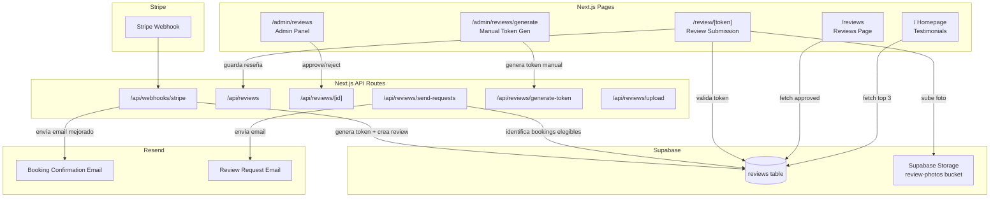
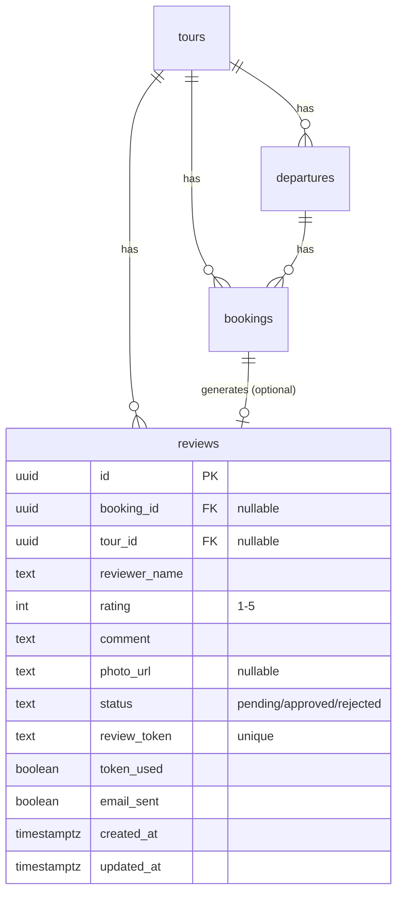

# Design Document: Review System

## Overview

El sistema de reseñas permite a los clientes de EMO Tours CDMX dejar reseñas después de completar su tour. El flujo principal es:

1. Al confirmar un pago (Stripe webhook), se genera un `review_token` y se crea un registro de reseña en estado "pending"
2. Después de la fecha del tour, se envía un email de solicitud de reseña con un link único `/review/[token]`
3. El cliente accede a la página de envío, califica con estrellas (1-5), escribe un comentario y opcionalmente sube una foto
4. El admin aprueba o rechaza la reseña desde el panel de administración
5. Las reseñas aprobadas se muestran en `/reviews` y en la sección de testimonios del homepage

Adicionalmente, el admin puede generar tokens manualmente para clientes pasados que no tienen booking en el sistema.

### Decisiones de diseño clave

- **Token-based access**: No se requiere autenticación del usuario. El token es el mecanismo de acceso, similar a un "magic link".
- **Supabase Storage** para fotos: Reutiliza la infraestructura existente.
- **Server Actions / API Routes**: Se mantiene el patrón existente de API routes en `src/app/api/`.
- **Revalidación ISR**: Las páginas `/reviews` y homepage usan `revalidate` para cachear y refrescar periódicamente.

## Architecture



## Components and Interfaces

### Database Migration

Nuevo archivo SQL de migración que crea la tabla `reviews` con las columnas especificadas en los requisitos, incluyendo constraints de unicidad en `booking_id` y `review_token`, y CHECK constraint en `rating`.

### API Routes

| Route | Method | Purpose |
|---|---|---|
| `/api/webhooks/stripe` | POST | Modificar handler existente para generar review token al confirmar booking |
| `/api/reviews` | GET | Listar reseñas (con filtros: status, tour_id) |
| `/api/reviews` | POST | Enviar reseña (desde la página de submission) |
| `/api/reviews/[id]` | PATCH | Actualizar status de reseña (admin: approve/reject) |
| `/api/reviews/send-requests` | POST | Endpoint para enviar emails de solicitud de reseña a bookings elegibles |
| `/api/reviews/generate-token` | POST | Generar token manual para clientes pasados |
| `/api/reviews/upload` | POST | Subir foto a Supabase Storage |

### Pages

| Page | Type | Purpose |
|---|---|---|
| `/review/[token]` | Client + Server | Página de envío de reseña con formulario |
| `/reviews` | Server (ISR) | Página pública con reseñas aprobadas |
| `/admin/reviews` | Client | Panel de administración de reseñas |
| `/admin/reviews/generate` | Client | Formulario para generar tokens manuales |

### Lib Modules

| Module | Purpose |
|---|---|
| `src/lib/review-tokens.ts` | Generación de tokens criptográficamente seguros (crypto.randomBytes) |
| `src/lib/emails.ts` | Extender con `sendReviewRequestEmail` y mejorar `sendBookingConfirmationEmail` |
| `src/lib/validators.ts` | Extender con `validateReviewSubmission` y `validateManualTokenRequest` |

### Components

| Component | Purpose |
|---|---|
| `src/components/reviews/StarRating.tsx` | Selector interactivo de estrellas (1-5) |
| `src/components/reviews/ReviewCard.tsx` | Card reutilizable para mostrar una reseña |
| `src/components/reviews/PhotoUpload.tsx` | Input de upload de foto con preview y validación |
| `src/components/admin/ReviewsManager.tsx` | Tabla de administración de reseñas con acciones approve/reject |

### Interfaces

```typescript
// Nuevos tipos en src/types/index.ts

export type ReviewStatus = 'pending' | 'approved' | 'rejected';

export interface Review {
  id: string;
  booking_id: string | null;
  tour_id: string | null;
  reviewer_name: string;
  rating: number;        // 1-5
  comment: string;
  photo_url: string | null;
  status: ReviewStatus;
  review_token: string;
  token_used: boolean;
  created_at: string;
  updated_at: string;
}

export interface ReviewSubmissionPayload {
  token: string;
  rating: number;
  comment: string;
  photo_url?: string;
}

export interface ManualTokenRequest {
  reviewer_name: string;
  email: string;
  tour_name: string;
}

export interface ReviewWithTour extends Review {
  tour_title: string;
}
```

## Data Models

### reviews table

```sql
CREATE TABLE reviews (
  id            uuid        PRIMARY KEY DEFAULT gen_random_uuid(),
  booking_id    uuid        REFERENCES bookings(id) ON DELETE SET NULL,
  tour_id       uuid        REFERENCES tours(id) ON DELETE SET NULL,
  reviewer_name text        NOT NULL,
  rating        integer     CHECK (rating >= 1 AND rating <= 5),
  comment       text,
  photo_url     text,
  status        text        NOT NULL DEFAULT 'pending'
                CHECK (status IN ('pending', 'approved', 'rejected')),
  review_token  text        NOT NULL UNIQUE,
  token_used    boolean     NOT NULL DEFAULT false,
  email_sent    boolean     NOT NULL DEFAULT false,
  created_at    timestamptz NOT NULL DEFAULT now(),
  updated_at    timestamptz NOT NULL DEFAULT now()
);

-- Unique constraint: one review per booking (nullable, so manual reviews skip this)
CREATE UNIQUE INDEX idx_reviews_booking_id ON reviews(booking_id) WHERE booking_id IS NOT NULL;

-- Index for token lookups
CREATE INDEX idx_reviews_token ON reviews(review_token);

-- Index for public queries (approved reviews)
CREATE INDEX idx_reviews_status_created ON reviews(status, created_at DESC);

-- Index for finding eligible review request emails
CREATE INDEX idx_reviews_email_eligible ON reviews(token_used, email_sent);
```

### Supabase Storage

- Bucket: `review-photos`
- Política de acceso: upload público (anónimo) con validación de tipo MIME en el API route
- Archivos nombrados como: `{review_id}/{timestamp}.{ext}`

### Relaciones




## Correctness Properties

*A property is a characteristic or behavior that should hold true across all valid executions of a system — essentially, a formal statement about what the system should do. Properties serve as the bridge between human-readable specifications and machine-verifiable correctness guarantees.*

### Property 1: Token format and entropy

*For any* generated review token, it SHALL have a length of at least 43 characters (32 bytes base64url-encoded), contain only URL-safe characters (alphanumeric, hyphen, underscore), and be unique across all previously generated tokens.

**Validates: Requirements 2.2**

### Property 2: Token generation idempotency

*For any* booking_id, calling the review token generation function multiple times SHALL result in exactly one review record for that booking_id. Subsequent calls after the first SHALL not create additional records.

**Validates: Requirements 2.3**

### Property 3: Review submission validation

*For any* review submission payload, the validator SHALL accept it if and only if the rating is an integer between 1 and 5 inclusive AND the comment has a length of at least 10 characters. All other inputs SHALL be rejected.

**Validates: Requirements 1.4, 4.5**

### Property 4: Review submission updates record and marks token used

*For any* valid review submission (valid rating, valid comment) with a valid unused token, the system SHALL update the review record with the submitted data, set token_used to true, and keep status as "pending".

**Validates: Requirements 4.2, 8.1**

### Property 5: Invalid or used token rejection

*For any* token that is either not present in the database or has token_used set to true, the review submission endpoint SHALL reject the request with an appropriate error.

**Validates: Requirements 4.4**

### Property 6: Photo upload validation

*For any* uploaded file, the system SHALL accept it if and only if its MIME type is one of image/jpeg, image/png, or image/webp AND its size is at most 5 MB. All other files SHALL be rejected.

**Validates: Requirements 4.7**

### Property 7: Review request email eligibility

*For any* set of review records, the eligibility filter SHALL return only those where: the associated booking is confirmed, the departure date is in the past, email_sent is false, AND token_used is false. All other records SHALL be excluded.

**Validates: Requirements 3.1, 3.4, 3.5**

### Property 8: Review request email content

*For any* eligible review, the generated review request email HTML SHALL contain the tour title, the departure date, and a link matching the pattern `/review/{review_token}`.

**Validates: Requirements 3.2**

### Property 9: Approved reviews query returns only approved, ordered by date

*For any* set of reviews with mixed statuses (pending, approved, rejected), the public reviews query SHALL return only those with status "approved", ordered by created_at descending.

**Validates: Requirements 5.1**

### Property 10: Reviews display contains required fields

*For any* approved review returned by the public query, the rendered output SHALL contain the reviewer_name, rating, comment text, and tour title. If photo_url is present, it SHALL also be included.

**Validates: Requirements 5.2, 6.2**

### Property 11: Average rating and count calculation

*For any* set of approved reviews, the computed average rating SHALL equal the sum of all ratings divided by the count of reviews (rounded to one decimal), and the count SHALL equal the total number of approved reviews.

**Validates: Requirements 5.3**

### Property 12: Homepage testimonials query constraints

*For any* set of reviews, the homepage testimonials query SHALL return at most 3 reviews, all with status "approved" and rating >= 4, ordered by created_at descending.

**Validates: Requirements 6.1**

### Property 13: Booking confirmation email contains all booking details

*For any* booking confirmation data (tour title, date, time, guest count, total, meeting point), the generated email HTML SHALL contain all six values.

**Validates: Requirements 7.3**

### Property 14: Admin status update with timestamp

*For any* review and any valid target status ("approved" or "rejected"), updating the review status SHALL change the status field to the target value and update the updated_at timestamp to a value greater than or equal to the previous updated_at.

**Validates: Requirements 8.2, 8.3**

### Property 15: Manual token generation creates valid review record

*For any* manual token request with a valid reviewer_name and tour reference, the system SHALL create a review record with status "pending", token_used false, booking_id null, and a valid review_token.

**Validates: Requirements 9.2, 9.5**

## Error Handling

### Token Errors
- **Invalid token**: Return 404 with user-friendly message "This review link is not valid."
- **Used token**: Return 410 (Gone) with message "This review link has already been used. Thank you for your feedback!"
- **Expired token**: No expiration by design — tokens remain valid until used.

### Submission Errors
- **Validation failure**: Return 400 with field-specific error messages (rating, comment length).
- **Photo upload failure**: Return 400 if file type/size invalid. Return 500 if Supabase Storage upload fails, with retry guidance.
- **Database error**: Return 500 with generic error message. Log details server-side.

### Webhook Errors
- **Missing booking_id**: Log error, skip review creation. Return 200 to Stripe to prevent retries.
- **Duplicate review**: Skip silently (idempotency). Return 200.

### Email Errors
- **Resend API failure**: Log error, do not mark email_sent as true so it can be retried.
- **Invalid email address**: Log and skip. Mark as sent to avoid infinite retries.

### Admin Errors
- **Invalid status value**: Return 400 with allowed values.
- **Review not found**: Return 404.

### Photo Upload Errors
- **File too large**: Return 400 with "File must be 5 MB or less."
- **Invalid file type**: Return 400 with "Only JPEG, PNG, and WebP images are accepted."
- **Storage bucket error**: Return 500, log details. Review is still saved without photo.

## Testing Strategy

### Property-Based Testing

Se utilizará **fast-check** (ya instalado en el proyecto) para implementar property-based tests. Cada test de propiedad debe ejecutar un mínimo de 100 iteraciones.

Cada test debe incluir un comentario de referencia al property del diseño:
- Formato: `Feature: review-system, Property {number}: {property_text}`

Properties a implementar con fast-check:

| Property | Test Description |
|---|---|
| 1 | Generar N tokens y verificar formato, longitud y unicidad |
| 2 | Llamar generación de token múltiples veces para el mismo booking_id, verificar un solo registro |
| 3 | Generar payloads aleatorios de review submission, verificar que solo los válidos pasan |
| 4 | Simular submission con token válido, verificar actualización de record |
| 5 | Intentar submission con tokens inválidos/usados, verificar rechazo |
| 6 | Generar archivos aleatorios con distintos tipos MIME y tamaños, verificar aceptación/rechazo |
| 7 | Generar conjuntos aleatorios de reviews con distintos estados, verificar filtro de elegibilidad |
| 8 | Generar datos de review elegible, verificar contenido del email HTML |
| 9 | Generar conjuntos de reviews con estados mixtos, verificar que solo approved se retornan en orden |
| 10 | Generar reviews aprobadas aleatorias, verificar que el render contiene todos los campos |
| 11 | Generar conjuntos de ratings aleatorios, verificar cálculo de promedio y conteo |
| 12 | Generar conjuntos de reviews aleatorias, verificar constraints del query de homepage |
| 13 | Generar datos de booking aleatorios, verificar que el email HTML contiene todos los valores |
| 14 | Generar updates de status aleatorios, verificar cambio de status y timestamp |
| 15 | Generar requests manuales aleatorios, verificar record creado correctamente |

### Unit Testing

Unit tests complementarios para casos específicos y edge cases:

- **Token generation**: Verificar que `generateReviewToken()` retorna string no vacío
- **Database constraints**: Verificar unique constraint en booking_id y review_token
- **Empty reviews page**: Verificar mensaje cuando no hay reseñas aprobadas
- **Homepage with < 3 reviews**: Verificar que muestra las disponibles sin slots vacíos
- **Booking confirmation email**: Verificar presencia de header, "Next Steps", y footer
- **Photo upload edge cases**: Archivo de 0 bytes, archivo de exactamente 5 MB
- **Review submission with photo**: Verificar que photo_url se guarda correctamente
- **Manual token without booking**: Verificar que booking_id es null

### Integration Testing

- Flujo completo: webhook → token generation → email → submission → approval → display
- Stripe webhook idempotency: enviar el mismo evento dos veces
- Review request email: verificar que no se envía a tokens ya usados
